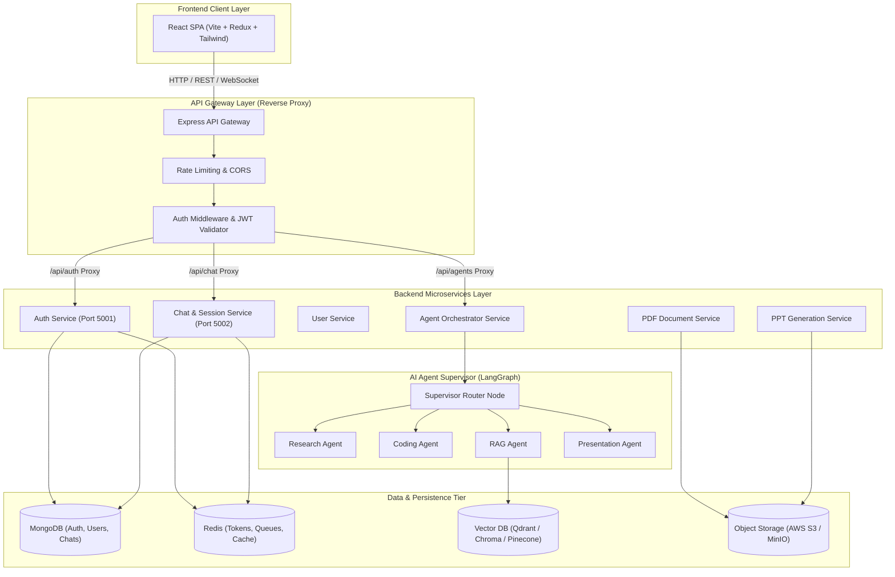
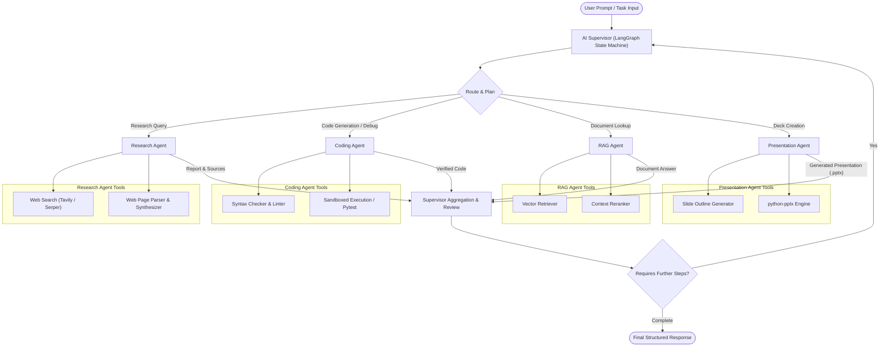
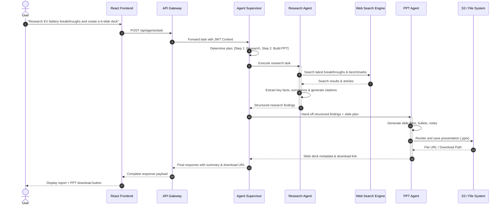
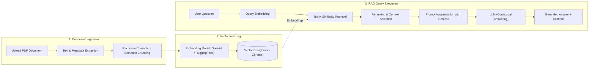
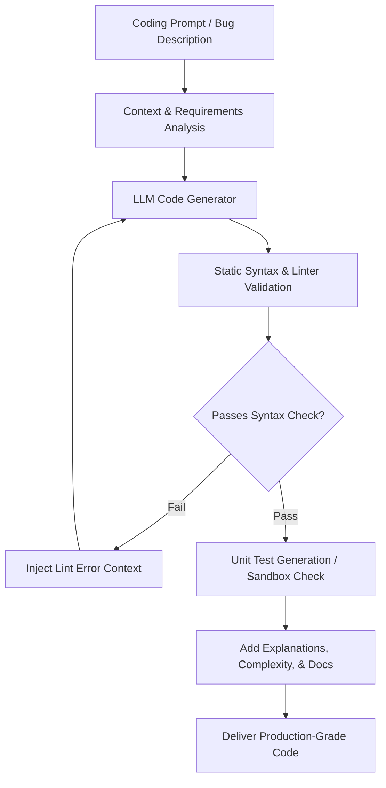
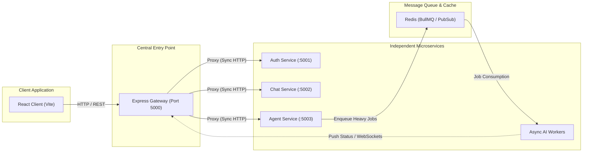
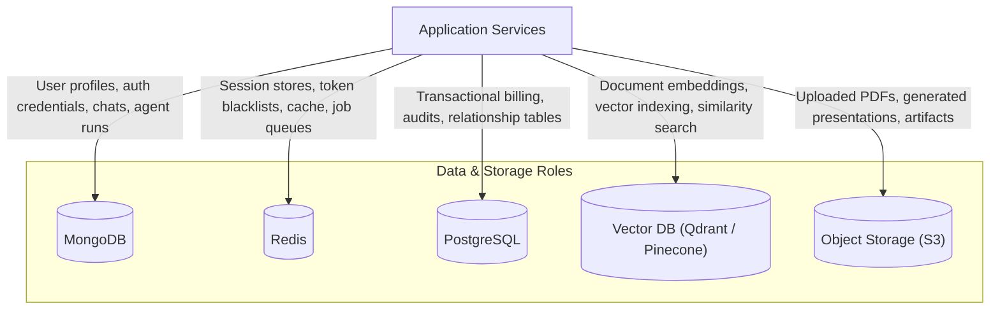
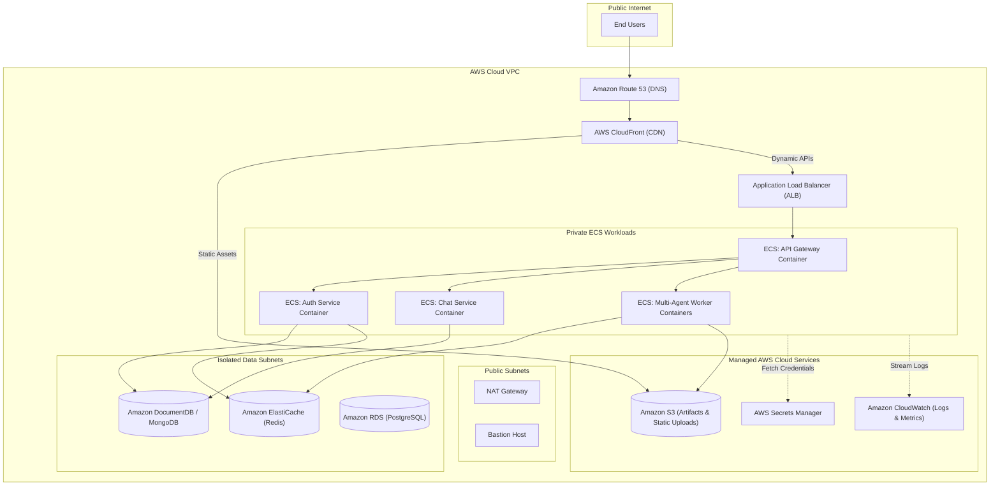
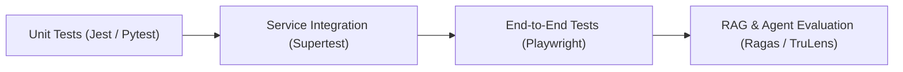
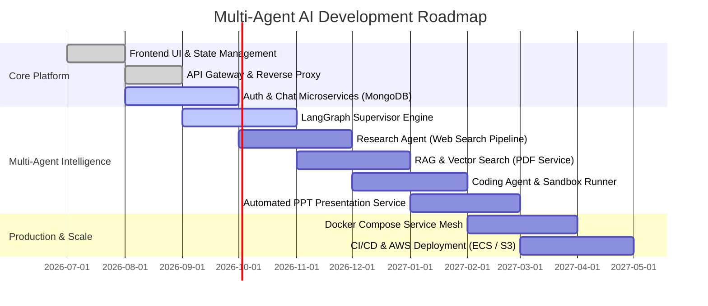

# 🤖 Multi-Agent AI System

<div align="center">


**An enterprise-grade, distributed multi-agent platform combining Generative AI, Retrieval-Augmented Generation (RAG), microservices, and cloud infrastructure for autonomous research, code intelligence, document analysis, and automated presentation generation.**

</div>

---

## 📑 Table of Contents

- [📌 Overview](#-overview)
- [🏗️ High-Level System Architecture](#️-high-level-system-architecture)
- [🧠 Multi-Agent Orchestration](#-multi-agent-orchestration)
- [🔄 Core Workflow Pipelines](#-core-workflow-pipelines)
  - [1. Research & Presentation Pipeline](#1-research--presentation-pipeline)
  - [2. PDF Intelligence & RAG Retrieval](#2-pdf-intelligence--rag-retrieval)
  - [3. Code Generation & Analysis Loop](#3-code-generation--analysis-loop)
- [🧩 Microservices & Distributed Communication](#-microservices--distributed-communication)
- [🗄️ Polyglot Data Architecture](#️-polyglot-data-architecture)
- [☁️ Cloud & Production Infrastructure](#️-cloud--production-infrastructure)
- [📂 Project Directory Structure](#-project-directory-structure)
- [🛠️ Technology Stack](#️-technology-stack)
- [🚦 Getting Started & Local Development](#-getting-started--local-development)
  - [Prerequisites](#prerequisites)
  - [Environment Setup](#environment-setup)
  - [Running the Services](#running-the-services)
- [🧪 Testing & Quality Strategy](#-testing--quality-strategy)
- [🚀 Roadmap & Implementation Milestones](#-roadmap--implementation-milestones)
- [🔐 Security Guidelines](#-security-guidelines)
- [👨‍💻 Author & Contact](#-author--contact)
- [📜 License](#-license)

---

## 📌 Overview

The **Multi-Agent AI System** solves complex knowledge and technical tasks by moving away from brittle, monolithic prompts toward an **orchestrated ecosystem of autonomous, specialized agents**.

Rather than expecting a single language model to handle broad research, synthesis, coding, document parsing, and file generation simultaneously, the platform delegates requests through an **Agent Supervisor (LangGraph)** to specialized workers:

* 🔎 **Research Agent**: Conducts multi-step web queries, validates source credibility, and aggregates cited findings.
* 💻 **Coding Agent**: Handles code generation, debugging, refactoring, code review, and test design.
* 📄 **PDF & Document Agent**: Extracts text, structures metadata, and chunks complex files for vector search.
* 📚 **RAG Agent**: Queries semantic vector embeddings with dense retrieval and contextual reranking.
* 📊 **Presentation (PPT) Agent**: Plans slide decks, formats content, and generates downloadable `.pptx` documents.

---

## 🏗️ High-Level System Architecture

The application is structured into decoupled layers: a modern single-page frontend, a central API Gateway with reverse-proxy routing and JWT validation, isolated microservices, a distributed agent orchestration engine, and polyglot persistent storage.



---

## 🧠 Multi-Agent Orchestration

The AI layer is structured around the **Supervisor-Worker Pattern** using **LangGraph**. The supervisor analyzes the user's intent, breaks it down into executable subtasks, coordinates tool-assisted subagents, and synthesizes the final result.



---

## 🔄 Core Workflow Pipelines

### 1. Research & Presentation Pipeline

When a user requests research on a topic and asks for a slide deck, the Supervisor sequences the task across multiple agents.



---

### 2. PDF Intelligence & RAG Retrieval

Documents are ingested, parsed into semantically cohesive passages, embedded with dense representation models, and indexed for low-latency contextual search.



---

### 3. Code Generation & Analysis Loop

The Coding Agent performs automated verification and iterative refinement to ensure syntax validity and proper formatting before delivering solutions.



---

## 🧩 Microservices & Distributed Communication

The system combines synchronous REST calls for user-facing interactions and asynchronous message brokering for compute-heavy AI tasks.



---

## 🗄️ Polyglot Data Architecture

To balance performance, flexibility, and scalability, each category of data is assigned to its ideal persistence technology:



| Storage Engine | Purpose | Data Stored |
|---|---|---|
| **MongoDB** | Document Store | User credentials, agent execution logs, conversation histories, prompt templates |
| **Redis** | In-Memory Key-Value & Queue | Refresh token cache, session storage, rate limiting counters, BullMQ job queues |
| **Vector DB** | Vector Index | High-dimensional chunk embeddings, semantic document search indices |
| **AWS S3 / MinIO** | Blob Storage | User-uploaded PDF documents, compiled `.pptx` presentation artifacts |
| **PostgreSQL** | Relational Store | Multi-tenant accounts, billing records, structured audit trails |

---

## ☁️ Cloud & Production Infrastructure

The application is engineered for containerized orchestration and deployment to Amazon Web Services (AWS) using industry standards.



---

## 📂 Project Directory Structure

```text
MultiAgentAI/
├── frontend/                     # React Single Page Application
│   ├── public/                   # Static assets & favicon
│   ├── src/
│   │   ├── apis/                 # Axios HTTP clients & service endpoints
│   │   ├── assets/               # Brand SVGs and design assets
│   │   ├── pages/                # Route views (Chat, Login, Dashboard)
│   │   ├── redux/                # Global state slices (auth, sessions, agents)
│   │   ├── App.jsx               # Application route layout
│   │   ├── index.css             # Tailwind design system tokens
│   │   └── main.jsx              # React DOM entry point
│   ├── package.json              # Frontend dependencies (React, Redux, Tailwind)
│   └── vite.config.js            # Vite build configuration
│
├── backend/                      # Microservices Backend Architecture
│   ├── docker-compose.yml        # Multi-container orchestration (Redis, Mongo)
│   ├── package.json              # Root backend tooling & shared scripts
│   │
│   ├── gateway/                  # Central API Gateway (:5000)
│   │   ├── controller/           # Gateway route controllers
│   │   ├── middleware/           # auth.middleware.js, rate-limiter, error-handler
│   │   ├── index.js              # Gateway entry point & reverse-proxy routing
│   │   └── package.json
│   │
│   ├── services/
│   │   ├── auth/                 # Authentication Service (:5001)
│   │   │   ├── config/           # MongoDB connection & env validation
│   │   │   ├── controller/       # Register, Login, Token Refresh handlers
│   │   │   ├── models/           # User schema & encryption methods
│   │   │   ├── routes/           # /api/auth routes
│   │   │   ├── index.js          # Auth Express microservice entry
│   │   │   └── package.json
│   │   │
│   │   ├── chat/                 # Chat & Conversation Service (:5002)
│   │   │   ├── config/           # Database & session cache setup
│   │   │   ├── models/           # Conversation & Message schemas
│   │   │   ├── index.js          # Chat Express microservice entry
│   │   │   └── package.json
│   │   │
│   │   ├── agent/                # [Roadmap] LangGraph Multi-Agent Orchestrator
│   │   ├── research/             # [Roadmap] Web Search & Synthesis Worker
│   │   ├── rag/                  # [Roadmap] Vector Search & Document Ingestion
│   │   ├── pdf/                  # [Roadmap] PDF Parsing & Chunking Service
│   │   └── ppt/                  # [Roadmap] Automated PowerPoint Builder
│   │
│   └── shared/                   # Reusable cross-service utilities
│       └── redis/                # Shared Redis connection client
│
├── infrastructure/               # [Roadmap] Infrastructure-as-Code (Terraform, Docker)
└── README.md                     # Comprehensive project documentation
```

---

## 🛠️ Technology Stack

| Domain | Technologies |
|---|---|
| **Frontend** | React 19, Vite, Redux Toolkit, Tailwind CSS, Axios, React Router |
| **Backend & Microservices** | Node.js (ESM), Express.js, `express-http-proxy`, Cookie-Parser, CORS |
| **Multi-Agent Orchestration** | LangGraph, LangChain, OpenAI / Anthropic / Gemini APIs, Tool Calling |
| **Information Retrieval & RAG** | Vector Databases (Qdrant, Pinecone, Chroma), Text Splitters, Dense Embeddings |
| **Databases & Caching** | MongoDB (Mongoose), Redis (ioredis), PostgreSQL |
| **File & Document Processing** | `pdf-parse`, `python-pptx`, Cloudinary / AWS S3 SDK |
| **DevOps & Containers** | Docker, Docker Compose, Nginx, GitHub Actions |
| **Cloud (AWS)** | AWS ECS, ECR, S3, CloudFront, Route 53, ALB, CloudWatch, Secrets Manager |

---

## 🚦 Getting Started & Local Development

### Prerequisites

Ensure you have the following installed locally:
* **Node.js**: `v18.0.0+`
* **npm**: `v9.0.0+`
* **Docker & Docker Compose**: For local Redis and MongoDB containers
* **Git**

---

### Environment Setup

Create `.env` files for each running service:

#### 1. API Gateway (`backend/gateway/.env`)
```env
PORT=5000
FRONTEND_URL=http://localhost:5173
AUTH_SERVICE=http://localhost:5001
CHAT_SERVICE=http://localhost:5002
JWT_SECRET=your_super_secret_jwt_key
```

#### 2. Auth Service (`backend/services/auth/.env`)
```env
PORT=5001
MONGO_URI=mongodb://localhost:27017/multi_agent_ai
JWT_SECRET=your_super_secret_jwt_key
REDIS_HOST=localhost
REDIS_PORT=6379
```

#### 3. Chat Service (`backend/services/chat/.env`)
```env
PORT=5002
MONGO_URI=mongodb://localhost:27017/multi_agent_ai
JWT_SECRET=your_super_secret_jwt_key
REDIS_HOST=localhost
REDIS_PORT=6379
```

#### 4. Frontend (`frontend/.env`)
```env
VITE_API_URL=http://localhost:5000
```

---

### Running the Services

#### Step 1: Start Redis using Docker Compose
```bash
cd backend
docker-compose up -d redis
```

#### Step 2: Start the Backend Microservices
Open separate terminal tabs or use a process runner:

```bash
# Terminal 1: Auth Service
cd backend/services/auth
npm install
npm run dev # or node index.js

# Terminal 2: Chat Service
cd backend/services/chat
npm install
npm run dev # or node index.js

# Terminal 3: API Gateway
cd backend/gateway
npm install
npm run dev # or node index.js
```

#### Step 3: Start the Frontend Application
```bash
cd frontend
npm install
npm run dev
```

Visit **`http://localhost:5173`** in your browser to interact with the platform.

---

## 🧪 Testing & Quality Strategy



* **Unit Testing**: Tests domain logic, token generation, parsing, and data validation in isolation.
* **Integration Testing**: Verifies reverse-proxy gateway routing, JWT validation middleware, and service-to-service calls.
* **RAG & Agent Evaluation**: Evaluates retrieval recall, context relevancy, faithfulness, and answer correctness.
* **E2E Testing**: Validates end-to-end user journeys from login to multi-agent task completion.

---

## 🚀 Roadmap & Implementation Milestones



- [x] **Phase 1: Frontend Foundation** — Responsive UI, Redux stores, authentication forms, chat screens.
- [x] **Phase 2: API Gateway Layer** — Reverse proxy routing, cookie validation, JWT verification, and CORS configuration.
- [x] **Phase 3: Core Microservices** — Auth Service (registration/login/JWT), Chat Service with MongoDB integration, Redis container.
- [ ] **Phase 4: LangGraph Supervisor Orchestrator** — Dynamic task planning, state machine routing, fallback policies.
- [ ] **Phase 5: Autonomous Research Agent** — Multi-query web exploration, citation tracking, and report synthesis.
- [ ] **Phase 6: PDF Processing & RAG Engine** — Document upload, semantic chunking, vector embeddings, and dense retrieval.
- [ ] **Phase 7: Coding Agent** — Automated code generation, syntax validation, and self-correcting execution loops.
- [ ] **Phase 8: Automated PPT Generation** — Outline synthesis, slide layout generation, and direct `.pptx` downloads.
- [ ] **Phase 9: Distributed Background Workers** — BullMQ queues, asynchronous execution, and WebSocket notifications.
- [ ] **Phase 10: Production Cloud Deployment** — AWS ECS, CloudFront, ALB, S3, Secrets Manager, and CI/CD pipelines.

---

## 🔐 Security Guidelines

> [!IMPORTANT]
> **Zero Secrets in Version Control**: Never commit `.env` files, JWT secrets, database connection strings, or cloud provider access keys to source repositories.

* **Authentication & Authorization**: HttpOnly cookies with JWT token rotation and secure session expiration.
* **Network Isolation**: Backend microservices and databases reside in private subnets, accessible only through the API Gateway.
* **Input Sanitization**: Strict schema validation on all ingress endpoints to prevent SQL/NoSQL injection and prompt injection.
* **Rate Limiting**: Request throttling at the API Gateway level to safeguard against DDoS and API key quota exhaustion.

---

**Abhishek Roy**  

---

## 📜 License

This project is licensed under the [MIT License](LICENSE) — free for educational, research, and portfolio use.
